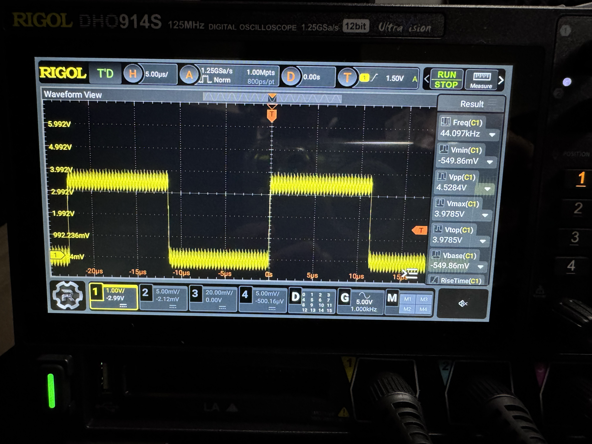
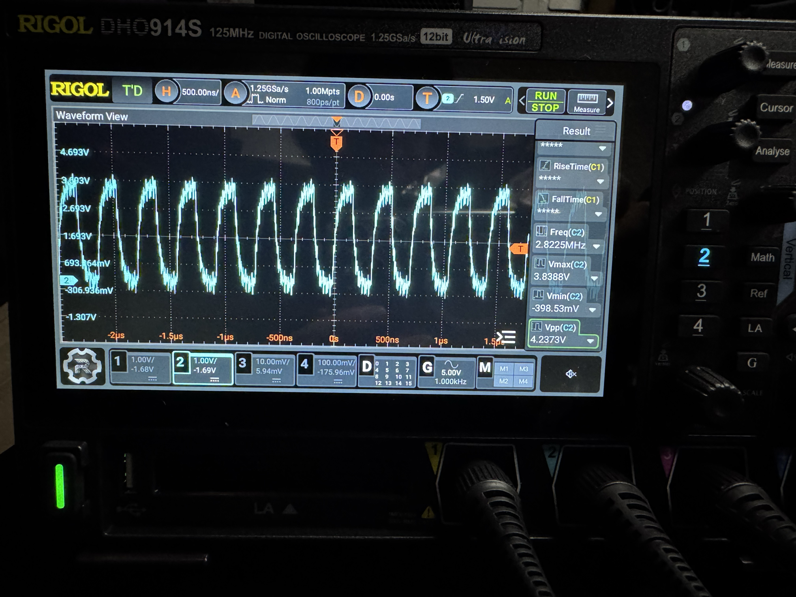
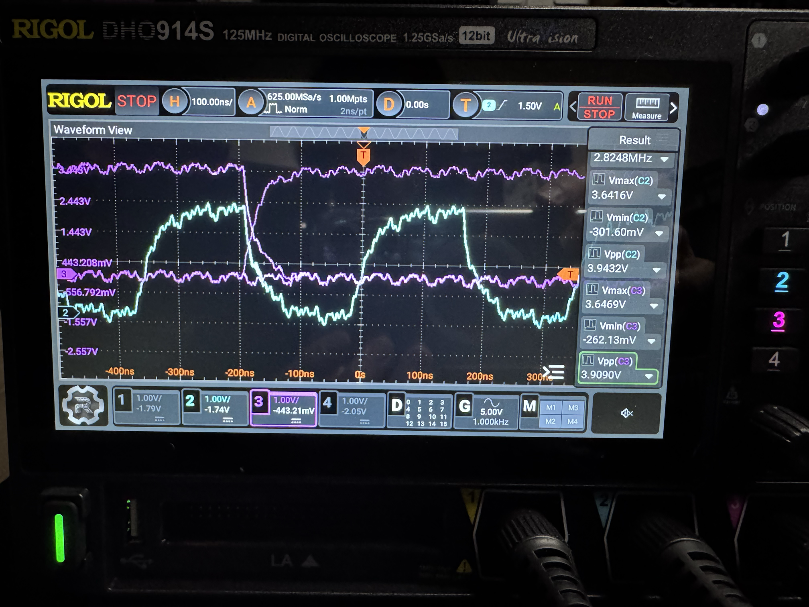
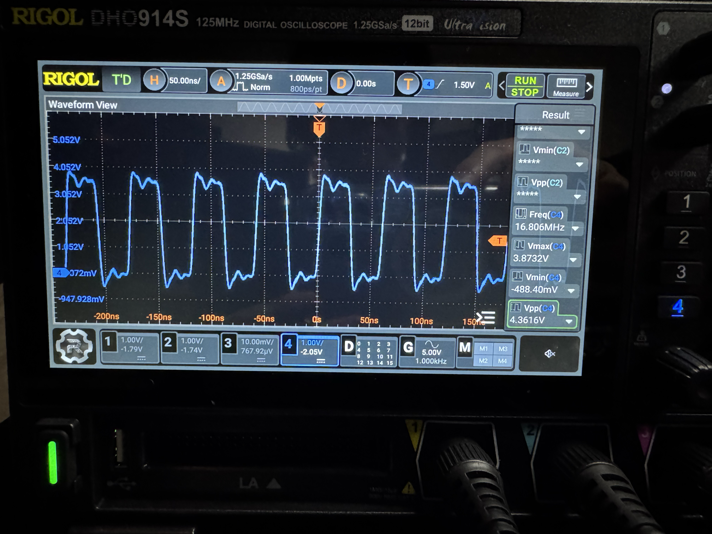

# PS1 S/PDIF FPGA PoC

> Work sequence (2026-09-04): see [direct SPU first, PIO later](docs/direct-to-pio-plan.en.md). Validate the direct connection before moving to PIO. The [common RTL fixes](docs/rtl-backport.en.md) have been backported. Hardware remains unverified.

[日本語版 / Japanese](README.md)

See the [provisional direct-SPU circuit and Akizuki parts](docs/spu-direct-build.en.md). PS1 measurements have started, but electrical compatibility remains unverified and the interface is not released for wiring.

Proof of concept for:

```text
SCPH-7000 / PU-20 (CXD2925Q)
        -> Tang Nano 9K (GW1NR-9)
        -> IEC 60958 / S/PDIF
        -> Akizuki 109598 (Everlight PLT133/T10W)
```

**Do not connect the PlayStation to the FPGA yet.** The CXD2925Q signal voltage,
sampling edge, LRCK polarity, slot length, and exact right-justified boundary
must first be measured on the actual PU-20. A wrong voltage can permanently
damage either board. This repository deliberately does not guess those facts.

## Current state

See the [Parallel I/O S/PDIF dongle design study](docs/parallel-io-dongle.en.md)
for future plans, with primary evidence, third-party reports, and untested
hypotheses separated. PIO support is not implemented.

- portable 16-bit right-justified PCM receiver
- portable 4-entry asynchronous FIFO
- IEC 60958 consumer stereo frame generator and BMC output
- exact clock-enable division from expected `384*Fs` WCKO to `128*Fs`
- Tang Nano 9K top, device selection, and pin constraints
- self-checking receiver and transmitter testbenches
- placeholder platform directories for [GW1N-1](platform/tang_nano_gw1n1/README.en.md) and [GW1NZ-1](platform/tang_nano_1k_gw1nz1/README.en.md)

The 9K platform uses WCKO directly and therefore instantiates no PLL. If WCKO
is confirmed as 16.9344 MHz (`384 * 44.1 kHz`), a pulse every three WCKO cycles
is exactly the 5.6448 MHz BMC half-bit rate. `audio_clock.v` remains a separate
platform wrapper so a generated rPLL can replace it without changing the core.

## Design

```text
BCKO/LRCO/DATO -> right-justified RX --write--> async FIFO
                                                   |
WCKO -> platform audio_clock -> IEC 60958 + BMC <--read
                                      |
                                  PLT133/T10W
```

The receiver keeps the final 16 sampled bits of each LRCK slot. It exposes
`LRCK_LEFT` and `SAMPLE_ON_NEGEDGE` parameters; their current top-level values
are placeholders, not claims about CXD2925Q timing.

The transmitter emits 192 stereo frames per channel-status block, Z/X/Y
preambles, 16-bit audio in subframe bits 12..27, validity/user/channel-status,
even parity, and BMC. The consumer channel-status block is currently all zero;
that encodes consumer linear audio, no pre-emphasis, and the standard 44.1 kHz
frequency code. Professional/copyright/category/word-length refinements are
outside this PoC.

## PU-20 wiring candidates — measure before connecting

The working hypothesis from prior reverse-engineering references is:

| CXD2925Q candidate | Function | Tang Nano 9K PoC header | FPGA pin |
|---|---|---|---:|
| pin 100 `WCKO` | expected 16.9344 MHz / 384 Fs | J5-5 | 25 |
| pin 97 `BCKO` | serial bit clock | J5-6 | 26 |
| pin 98 `LRCO` | 44.1 kHz word/channel clock | J5-7 | 27 |
| pin 99 `DATO` | serial PCM | J5-8 | 28 |
| a verified digital ground | common reference | J5 GND | — |

These CXD2925Q pin numbers and timing assumptions are **candidates**, not fully
confirmed here from a Sony timing diagram. Verify IC orientation and continuity
on the exact PU-20 revision. Do not infer numbering from a board photograph.

The selected Nano 9K pins 25..29 are exposed on J5-5..J5-9 and are in 3.3 V I/O
banks in Sipeed's official schematic. This does **not** prove the PS1 signals are
3.3 V compatible.

### LRCO / BCKO / DATO / MCLK measurement evidence (2026-09-06)

The unit under test is SCPH-7000 / PU-20. The operator reports using the DAC-side LRCK/BCK/MCLK points and the board-ground point pictured in step 5 of the [ConsoleMods 700x guide](https://consolemods.org/wiki/PS1:Digital_Audio_(SPDIF)_Mod).
This third-party reference and operator report do not establish continuity to CXD2925Q pins or confirmation by Sony primary documentation.

Measurements used a RIGOL DHO914S, a 10X passive probe, DC coupling and no 20 MHz bandwidth limit.
Before measuring the PS1, the probe-compensation output was observed at approximately 3.076 Vpp with a flat square-wave top.
The standard long alligator ground lead was connected directly to board ground, so transient peaks may include ground-loop inductance and pickup.

#### LRCO (LRCK in the ConsoleMods guide)



| Item | Observation / status |
|---|---|
| Frequency | CH1 displays 44.097 kHz after rechecking 10X attenuation. This agrees with the earlier 44.101 kHz observation; **approximately 44.1 kHz is confirmed** |
| Timebase and acquisition | 5 µs/div, 1.25 GSa/s, 1.00 Mpts, as displayed |
| Peak readings | Vmax 3.9785 V, Vmin -549.86 mV and Vpp 4.5284 V. Long-ground-lead effects have not been separated, so these are not terminal guarantees |
| Unresolved | Guaranteed DC High/Low range, transient peaks, channel polarity, slot boundary and FPGA connection suitability |

#### BCKO (BCK in the ConsoleMods guide)



| Item | Observation / status |
|---|---|
| Frequency | CH2 displays 2.8225 MHz. Its ratio to 44.097 kHz LRCO is approximately 64.01; **approximately 2.8224 MHz / 64 Fs is confirmed** |
| Timebase and acquisition | 500 ns/div, 1.25 GSa/s, 1.00 Mpts, as displayed |
| Peak readings | Vmax 3.8388 V, Vmin -398.53 mV and Vpp 4.2373 V. This used an alligator lead directly on board ground and is not a terminal guarantee |
| Unresolved | Shortest period, duty variation, edges, DATO setup/hold and FPGA connection suitability |

#### DATO (DATA in the ConsoleMods guide) relative to BCKO

CH2=BCKO and CH3=DATO were measured together while playing an audio CD. DATO remained near Low while playback was stopped and began making data transitions after playback started.



| Item | Observation / status |
|---|---|
| Observed edge relationship | In this acquisition, DATO transitions occur near BCKO falling edges and DATO appears stable near BCKO rising edges. **BCKO rising-edge capture is the leading candidate**, but this single acquisition does not establish it conclusively |
| Timebase and acquisition | 100 ns/div, 625 MSa/s, 1.00 Mpts, 12 bit, CH2/CH3 at 1 V/div, CH2 rising-edge trigger at 1.5 V and 10X probes, from the display and operator confirmation |
| BCKO readings | 2.8248 MHz, Vmax 3.6416 V, Vmin -301.60 mV and Vpp 3.9432 V |
| DATO readings | Vmax 3.6469 V, Vmin -262.13 mV and Vpp 3.9090 V |
| Unresolved | Inter-probe skew, exact setup/hold, channel polarity, slot boundary, 16-bit Right-Justified bit position and FPGA connection suitability |

Long-ground-lead effects may be present in the voltage readings and apparent edge shapes, so they are not terminal guarantees or evidence that a direct connection is safe.

#### MCLK in the ConsoleMods guide (WCKO candidate)



| Item | Observation / status |
|---|---|
| Frequency | CH4 displays 16.806 MHz in the published photograph; 16.949 MHz was displayed immediately beforehand in the same measurement session. The latest ratios are approximately 381.11 to LRCO and 5.954 to BCKO. They are **close to the 384 Fs / six-times-BCKO candidate, but do not confirm the exact ratios** |
| Timebase and acquisition | 50 ns/div, 1.25 GSa/s, 1.00 Mpts, 12 bit, CH4 at 1 V/div and a 10X probe, from the display and operator confirmation |
| Peak readings | Vmax 3.8732 V, Vmin -488.40 mV and Vpp 4.3616 V. Long-ground-lead effects and the visible ringing have not been separated, so these are not terminal guarantees |
| Unresolved | Cause of the difference between 16.806 MHz and the preceding 16.949 MHz observation, agreement with nominal 16.9344 MHz, exact synchronization/phase to LRCO/BCKO, continuity to CXD2925Q pin 100 WCKO and FPGA connection suitability |

The MCLK measurement supports the ConsoleMods pickup as a candidate for the current RTL's WCKO input, but does not confirm 384 Fs or provide primary evidence that both names identify the same net.
These are hardware observations of frequency and ratio, not proof of 3.3 V compatibility or permission for direct connection.
The public PNG files were re-encoded from HEIC without carrying over EXIF/XMP capture metadata.

### Oscilloscope checklist

These checks require an oscilloscope. The project developer uses a RIGOL
DHO914S, but another instrument with adequate bandwidth, channel count, and
measurement capabilities can be used. Probe the console signals before making
a galvanic connection to the Nano 9K:

1. Confirm ground reference and DC high/low voltages on WCKO, BCKO, LRCO, DATO.
2. Confirm LRCO is approximately 44.1 kHz and WCKO approximately 16.9344 MHz.
3. Measure BCKO frequency and count BCK cycles in each LRCO half/slot.
4. Decode a non-silent, asymmetric stereo test signal. Determine LRCO polarity,
   MSB/LSB order, the last 16-bit position, and whether data is stable on BCKO
   rising or falling edges.
5. Check setup/hold margin at the candidate FPGA sampling edge.
6. Only if levels meet the GW1NR 3.3 V bank limits, connect through short wires
   with a common ground. Otherwise design a proper level shifter/buffer first.
7. Recheck waveforms after connection for loading, ringing, and overshoot.
8. Confirm the S/PDIF half-bit rate is 5.6448 MHz (approximately 177.15 ns per
   half-bit), and check receiver lock and left/right channel identity. Actual
   transition counts depend on data and preambles.

After measurement, update the two parameters in `platform/tang_nano_9k/top.v`
and complete the SDC using [timing and waveform validation](docs/timing-validation.en.md).
Clock periods alone are insufficient: input delays, FIFO crossings and reset
paths also require verification.

## PLT133/T10W (Akizuki 109598)

The manufacturer's Rev.5 datasheet specifies a 2.7–5.5 V recommended supply,
TTL-compatible input (`VIH >= 2.0 V`, `VIL <= 0.8 V`), 16 Mbps maximum rate,
and pin functions: 1=Vin, 2=Vcc, 3=GND, 4/5=NC.

For the PoC:

```text
Tang Nano J5-9 / FPGA pin 29 (spdif_out) -> PLT133 pin 1 Vin
Tang Nano 3V3                         -> PLT133 pin 2 Vcc
Tang Nano GND                         -> PLT133 pin 3 GND
0.1 uF ceramic directly between pins 2 and 3
PLT133 pins 4 and 5                    -> no connection
```

Power Vin and Vcc down together as required by the datasheet. Never feed 5 V
logic into a Nano 9K GPIO. The transmitter input must not float (the module can
turn its LED on when Vin floats).

Akizuki product page:
https://akizukidenshi.com/catalog/g/g109598/

Everlight datasheet:
https://www.everlighteurope.com/custom/files/datasheets/DPL-0000049.pdf

## Simulation

Install Icarus Verilog, then run:

```sh
make test
```

Python 3 is also required. See [common RTL backport](docs/rtl-backport.en.md).
Tests now include FIFO capacity/full/order/wrap/reset and eight direct 384Fs
configurations (both edges, both LRCLK polarities, 16/32-bit slots). External
S/PDIF decoding checks 419 stereo pairs per case, order, alignment, parity,
preambles, block wrap and invalid/muted underflow. These normalized-clock tests
do not prove electrical safety, actual synchronization or Gowin timing closure.

Output stability is checked at every recorded TX clock cycle within each
half-bit. Tests reject corruption at each of its two following cycles and
accept valid waveforms with changed reset latency. Sub-cycle glitches and
physical routing delays are outside this test's coverage.

The RX test uses 32-bit slots containing distinct final 16-bit samples. The TX
test checks frame request cadence and BMC activity. Hardware-level timing and
optical interoperability still require the measurements above.

## Gowin EDA build and programming (Tang Nano 9K)

1. Open `platform/tang_nano_9k/ps1_spdif.gprj` in Gowin EDA.
2. Confirm device `GW1NR-LV9QN88PC6/I5` and top module `top`.
3. Follow [timing and waveform validation](docs/timing-validation.en.md) to
   resolve clock, input-delay and CDC constraints using measurements and actual
   synthesized node names. The current SDC is an unmeasured template.
4. Run **Synthesize**, then **Place & Route**. Check clock routing, input
   setup/hold, FIFO paths, resets and exception coverage. Clearing
   unconstrained-clock warnings alone is insufficient.
5. Connect the Nano 9K USB port and open Gowin Programmer.
6. Scan the JTAG chain, select the generated `.fs`, and use SRAM programming for
   the first reversible test. Use embedded/external flash only after validation.
7. Test the FPGA and optical module with a safe synthetic source before attaching
   the console.

Exact menu labels vary by Gowin EDA release; Sipeed's Nano 9K documentation and
Gowin Software User Guide cover driver/license setup.

## Known unknowns / stop conditions

- CXD2925Q output voltage and drive capability on this PU-20
- BCKO sampling edge and DATO setup/hold timing
- LRCO polarity and precise boundary behavior
- number of BCKO cycles per slot and whether padding exists before the sample
- WCKO frequency and phase continuity in all console audio states
- power sequencing between the powered console, Nano 9K, and optical module

Do not resolve any item by trial wiring. Stop, measure, and update RTL/constraints
from evidence. If the PS1 high level exceeds the Nano 9K bank rating or overshoot
crosses the absolute maximum, a level translator is mandatory.

## References and license

This original implementation is MIT licensed. The architecture was informed by
puhitaku/YOTSUHACK's working Tang Nano design. That repository is MIT at top
level, but its Ultra-Embedded S/PDIF RTL is GPL-2.0-or-later. None of that RTL is
copied here. See [sources and licensing](THIRD_PARTY.en.md) for the exact provenance and official Sipeed
sources.
