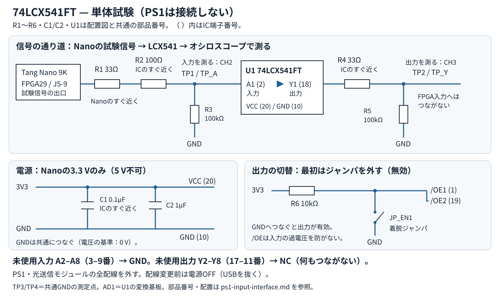
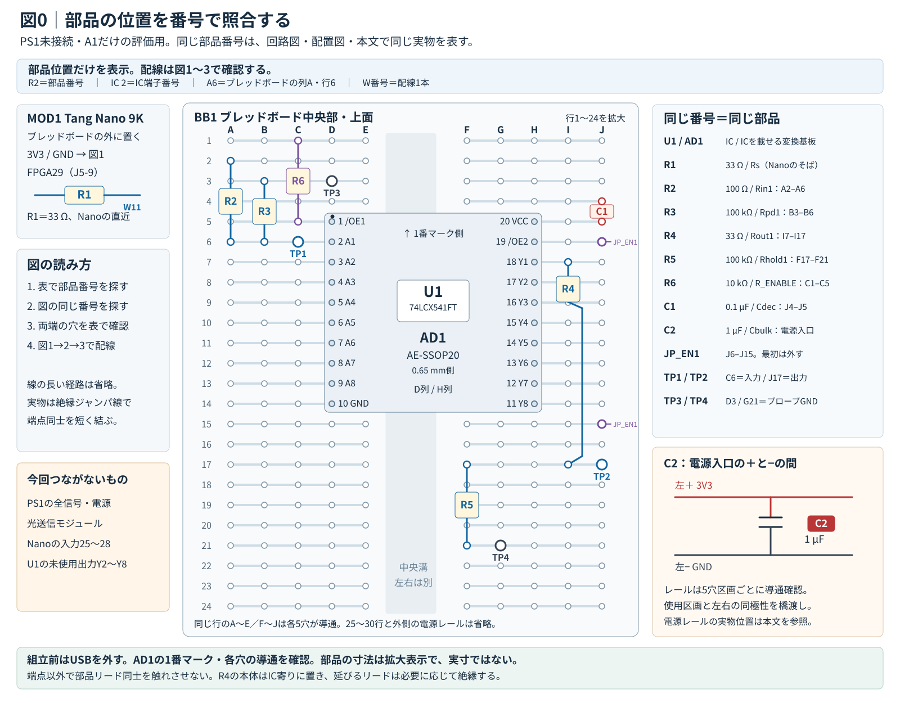
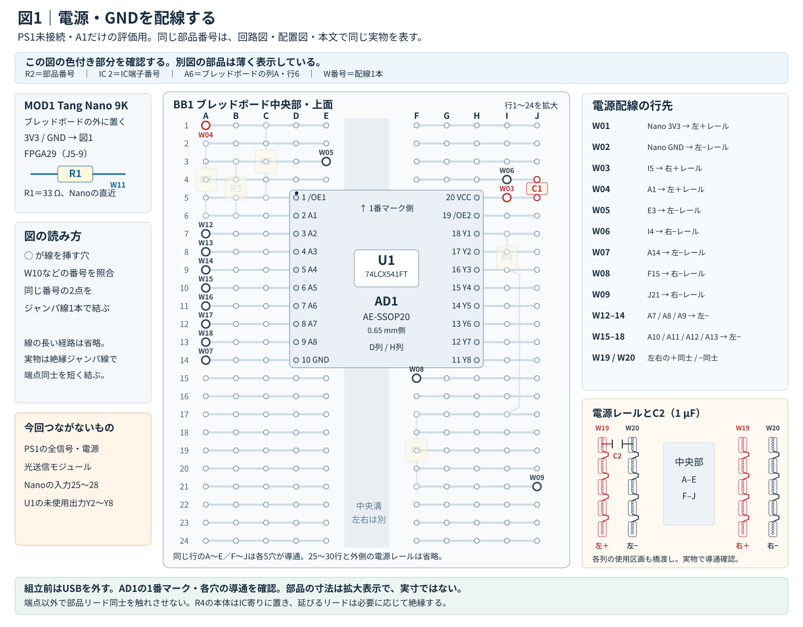
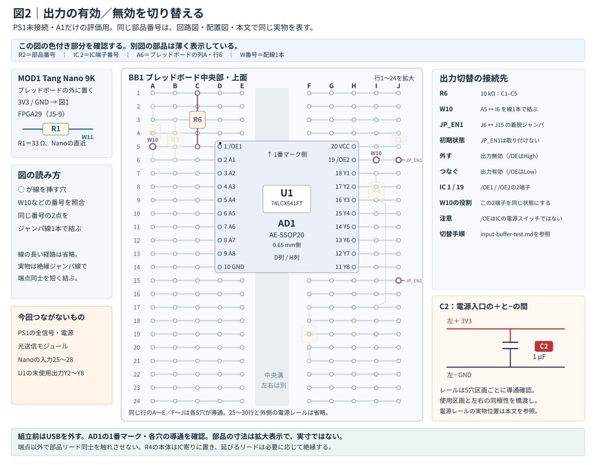
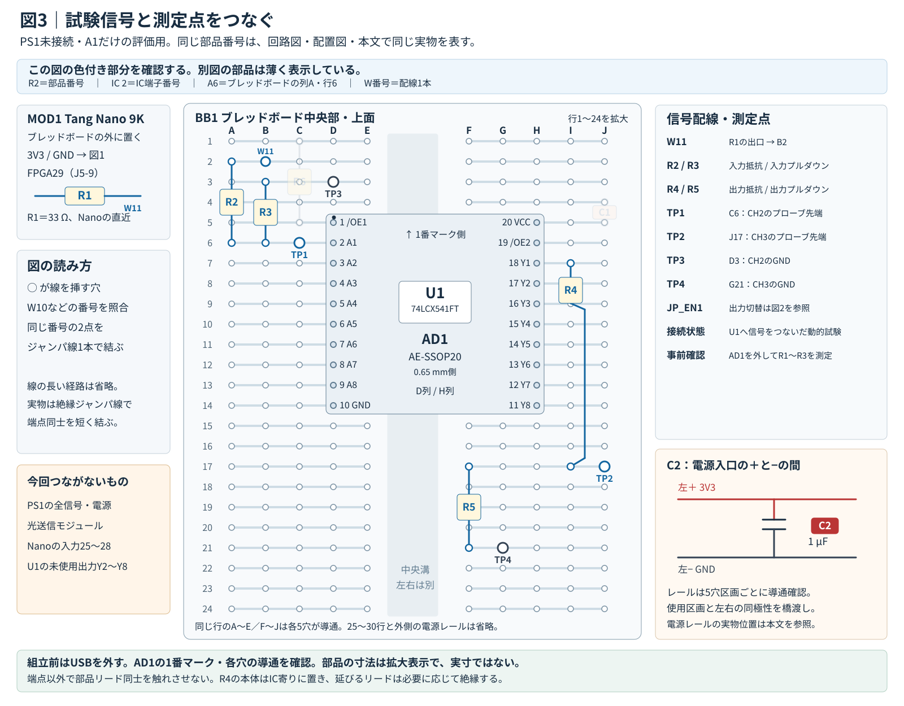

# PS1入力回路：74LCX541FTによる評価案

[English](ps1-input-interface.en.md) / [README](../README.md) / [SPU直結製作](spu-direct-build.md)

2026-09-10。2026-09-13ブレッドボード配置例追加・部品番号と分割配線図を整備。日本語を正本とする。**設計レビュー用・PS1接続未承認**。部品候補と論理接続を具体化した。負電圧・入力傾斜・電源遷移の確認前に施工用の確定回路としない。

目次：[採用方針](#採用方針) / [論理回路案](#論理回路案) / [ブレッドボード構築イメージ](#ブレッドボード構築イメージ) / [購入候補](#購入候補) / [接続条件](#接続条件) / [出典](#出典)

## 採用方針

第一候補は東芝 **74LCX541FT**。非反転8回路のうち4回路を使い、MCLK候補・BCK・LRCK・DATAを同じIC経由で受ける。メーカー仕様と今回の設計判断を以下で区別する。

- メーカー仕様：3.3 V給電で5.5 Vまでの入力に対応。電源OFF時の入出力保護を持つ。IOFFはVCC=0 V、VIN/VOUT=5.5 Vで10 µA以下という試験条件付きであり、完全な絶縁や電源遷移全域の保証ではない。
- メーカー仕様：入力閾値はVCC=2.7～3.6 VでVIH≧2.0 V、VIL≦0.8 V。伝搬遅延はVCC=3.3±0.3 Vの指定負荷条件で1.5～6.5 ns。入力傾斜にも0～10 ns/Vの条件がある（VCC=3.0 V、VIN=0.8～2.0 V）。単に17 MHz未満だから使えるとは判定しない。
- Gowin仕様：LVCMOS33のVIH下限2.0 V、VIL上限0.8 V。通常のI/O入力範囲と過渡条件を区別する。DS117の絶対最大定格には短時間の例外があり、過去写真のVmaxだけでFPGA破損を断定しない。
- 設計判断：バッファの出力をNano側3.3 V系統へ合わせ、PS1からFPGAへ直接入力する経路をなくす。3.3 V系統を共有しても配線の反射・起動時の挙動・出力競合は別途確認する。

## 論理回路案

以下は信号名による論理接続図。2026-09-12にメーカーPDFの端子図を画像で照合し、[PS1未接続の単体試験手順と端子番号付き配線図](input-buffer-test.md)を追加した。変換基板の穴番号・実物の向きは組立時に別途照合する。**端子番号の確認完了は、PS1入力の電気的適合や接続承認を意味しない。** 部品記号はこの入力基板内だけの名称。

```text
PS1 MCLK/BCK/LRCK/DATA（各信号について同じ回路）
  ─ Rin 100Ω ─ A入力 [U_IN: 74LCX541FT] Y出力 ─ Rout 33Ω ─ J_OUT ─ Nano入力
                │                                            │
                └ Rpd 100kΩ ─ GND                            └ Rhold 100kΩ ─ GND

Nano 3V3 ─ U_IN VCC
          ├ Cdec 0.1µF ─ GND （IC端子直近）
          └ Cbulk 1µF  ─ GND （補助、基板入口）
Nano GND ─ U_IN GND ─ PS1信号GND

U_IN /OE1 と /OE2 ─ 共通/OE ─ R_ENABLE 10kΩ ─ Nano 3V3
                           └ SW_ENABLE ─ GND （初期OPEN、閉で有効）
未使用A入力4本 → GND、対応Y出力4本 → 未接続
```

| 信号 | U_IN内の割当案 | Nanoヘッダー / FPGAパッケージ端子（既存CST） |
|---|---|---|
| ConsoleMods MCLK（WCKO候補） | A1 → Y1 | J5-5 / 25 |
| BCK | A2 → Y2 | J5-6 / 26 |
| LRCK | A3 → Y3 | J5-7 / 27 |
| DATA | A4 → Y4 | J5-8 / 28 |

Rin/Routは**評価開始値**。Rinはバッファ入力直近、Routはバッファ出力直近へ置く。いずれも負電圧クランプや確定した終端の代わりではない。Rpdは入力開放時用、Rholdは出力無効時用。PS1側へ3.3 Vのプルアップは置かない。PS1の電源端子とNanoの電源端子は結ばない。

SW_ENABLE（ブレッドボードでは固定したスイッチ、または無通電時だけ変更する着脱ジャンパ）は自動電源監視ではない。電源投入・切断・書込み時はOPENとし、出力無効を確認してから扱う。初期試験のJ_OUTはFPGA信号端子から切り離す。/OEをHighにしてもA入力はPS1へ接続されたままなので、入力過電圧への保護にはならない。

入力・出力・3V3に短いテスト端子を設け、それぞれの近くにGND端子を置く。ICは変換基板へはんだ付けし、長いブレッドボード配線を最終実装にしない。4信号の配線負荷と遅延差を記録する。Nanoのピン25/26のクロック配線・配置配線検証は別途必要。

## ブレッドボード構築イメージ

**今回はPS1未接続のA1単体試験だけを組み立てる。** 次の回路図と配置図では、例えば **R2はどちらも同じ100 Ω抵抗**を表す。`R2`は部品番号、`IC 2`はIC端子番号、`A6`はブレッドボードの列A・行6。これらを別々に読む。





[回路図を拡大](images/lcx541-standalone-test.svg) / [配置図を拡大](images/lcx541-input-breadboard-layout.svg)。図0は部品位置だけを示す。線を挿す穴は次の表で確認し、配線は図1〜3の順に追加する。

### 部品番号の対応表

番号は**この評価用回路内のもの**で、光送信側の部品番号とは別。既存の役割名も併記する。IC以外の部品の形や長さは模式表示で、現物に合わない間隔へ無理に挿さない。

| 部品番号 | 部品・既存の役割名 | ブレッドボード上の場所・両端の穴 |
|---|---|---|
| MOD1 / BB1 | Tang Nano 9K / ブレッドボード | Nanoはボードの外。3V3/GNDと試験出力だけを引き出す |
| U1 / AD1 | 74LCX541FT（U_IN）/ AE-SSOP20 | ICを変換基板の0.65 mm側へ実装。左列D5〜D14＝IC 1〜10、右列H5〜H14＝IC 20〜11 |
| R1 | 33 Ω / Rs | Nano FPGA29（J5-9）の直近。出口からW11でB2へ。抵抗を付けた露出接続部は絶縁する |
| R2 | 100 Ω / Rin1 | **A2–A6**。入力直前の抵抗 |
| R3 | 100 kΩ / Rpd1 | **B3–B6**。入力をLowへ寄せる抵抗 |
| R4 | 33 Ω / Rout1 | **I7–I17**。抵抗本体はIC側（I7寄り）、測定点側のリードを延ばす |
| R5 | 100 kΩ / Rhold1 | **F17–F21**。出力無効時に測定点をLowへ寄せる抵抗 |
| R6 | 10 kΩ / R_ENABLE | **C1–C5**。/OEをHigh（出力無効）へ寄せる抵抗 |
| C1 | 0.1 µFセラミック / Cdec | **J4–J5**。IC 20の近く。端子・配線は最短にする |
| C2 | 1 µFセラミック / Cbulk | 電源入口の左＋/左−レールの確認済み区画。それぞれ別の空き穴に挿す |
| JP_EN1 | 着脱ジャンパ / SW_ENABLE | **J6–J15**。最初は外す。図の両端マークは挿す位置で、2個の部品ではない |
| TP1 / TP2 | 入力TP_A1 / 出力TP_Y1 | **C6 / J17**。DHO914SのCH2 / CH3のプローブ先端を当てる |
| TP3 / TP4 | 入力側 / 出力側のGND測定点 | **D3 / G21**。各プローブのGNDをつなぐ |

`TP1/TP2`は[試験手順書](input-buffer-test.md)の`TP_A/TP_Y`と同じ点。チェック端子がなければ、測定用の短い端子を設ける。1穴に部品の脚とジャンパなどを重ねて挿さず、同じ5穴区画内の空き穴を使う。

**旧図からの配置変更：** 出力側を下の空き行へ移し、R4のリードと電源配線が重ならないようにした。R4は旧I7–I3→**I7–I17**、R5は旧F3–F1→**F17–F21**、TP_Y1は旧J3→**J17**。出力側GNDは行21を使う。電気的な接続と部品値は同じで、旧図の行1/3右側への配線は引き継がない。入力側GNDの引込みはE3、両/OEの橋渡しはA5–I6へ移し、部品の下に隠れる穴を避けた。

### 図1：電源・GND



[図1を拡大](images/lcx541-input-breadboard-power.svg)。図中の`W03`などは、表の配線1本を表す。長い接続線は省略し、**番号が付いた穴と表の行先をジャンパ線で結ぶ**。色だけで判断せず番号と端点を照合する。

| 配線番号 | 接続する2点 |
|---|---|
| W01 / W02 | Nanoの表示3V3（J6-24）→左＋ / 表示GND（J6-23）→左−。5 Vは使わない |
| W03 / W04 | I5→右＋ / A1→左＋ |
| W05 / W06 | E3→左− / I4→右− |
| W07 / W08 / W09 | A14→左− / F15→右− / J21→右− |
| W12 / W13 / W14 | A7 / A8 / A9からそれぞれ左−へ。未使用A2〜A4用の着脱配線 |
| W15 / W16 / W17 / W18 | A10 / A11 / A12 / A13からそれぞれ左−へ。未使用A5〜A8用 |
| W19 / W20 | 左＋と右＋ / 左−と右−。同じ番号のレール同士をつなぐ |

左＋/右＋は3V3、左−/右−はGNDに割り当てた電源レール。**使用区画どうしと左右の同極性を別途ジャンパで橋渡しし、導通を確認してから使う。** EIC-801は電源部の5穴区画を無条件に連続した1本のレールとみなさない。C2、Nano給電線、橋渡し線は同じ穴を共用しない。レールの省略図を実物の穴配置として数えない。

### 図2：出力切替（/OE）



[図2を拡大](images/lcx541-input-breadboard-enable.svg)。**W10＝A5–I6の1本**でIC 1と19を共通にする。R6はC1–C5。JP_EN1はJ6–J15で、最初は取り付けない。ジャンパを外すと出力無効、GNDへつなぐと有効になる。実際の切替・電源投入・書込みの順番は[単体試験手順](input-buffer-test.md#試験手順)に従う。

### 図3：試験信号・測定点



[図3を拡大](images/lcx541-input-breadboard-signal.svg)。**W11＝R1の出口→B2**。R2〜R5を対応表の穴へ取り付ける。薄い灰色の5穴間の線はボード内部の接続で、追加するジャンパではない。

信号の順番は `Nano FPGA29 → R1 → W11 → R2 → TP1 / U1 A1 → U1 Y1 → R4 → TP2`。入力CH2と出力CH3のプローブ先端は別の点、両方のGNDはTP3/TP4の共通GNDにつなぐ。TP2からNano入力へは戻さない。図3はA1接続後の動的試験の状態で、信号源だけを確認する段階では**AD1を挿す前にR1〜R3とTP1で測る**。接続変更・AD1着脱前はUSBを外す。

### 実物との照合と組立順

[EIC-801](https://akizukidenshi.com/catalog/g/g100315/)相当の、中央溝を挟んでA–E/F–Jが各5穴ずつ導通する30行ボードを想定し、図は使う側の24行だけを拡大した。AE-SSOP20は2.54 mmピッチ・600 mil幅の変換基板。**D/H列は現物のヘッダーが自然に挿さる場合の例**で、ピンを曲げて合わせない。変換基板の部品面・1番位置・穴との導通を照合する。`C1`という部品名と「列C・行1」という穴座標は、表の列で区別する。

1. USBを外し、U1とAD1のはんだブリッジ、IC端子から対応ヘッダーまでの導通、電源レールの分断と橋渡しを確認する。
2. 図1の電源部品・配線、図2のR6/W10を組む。JP_EN1は外す。未使用入力A2〜A8をGNDへつなぎ、未使用出力Y2〜Y8は何もつながない。
3. 図3の抵抗と測定点を配置するが、W11はまだつながない。[手順1・2](input-buffer-test.md#試験手順)の電源確認と静的試験を行う。
4. 信号源単体確認とA1への接続は[動的試験手順](input-buffer-test.md#3-約27-mhzの動的確認)に従う。各図は配線の分類で、通電を続けたまま順に作業する意味ではない。

リードが届かない、変換基板に隠れる、部品やジャンパの露出導体が触れる場合は、そのまま給電しない。同じ5穴区画の空き穴へ移せる場合も、接続表を更新して導通を再確認する。R4はIC寄りに置き、伸ばす側のリードを必要に応じて絶縁する。これは約2.7 MHzから始める基本動作確認用で、高速信号の最終配線の保証ではない。

将来のPS1入力・追加保護・A2〜A4の信号抵抗・Nano入力25〜28は、今回は図にも配線にも含めない。将来A2〜A4へ信号を入れる前は、USBを外してW12〜W14の該当GND配線を取り除く。入力側に保護追加用の空き領域を残し、未確定のクランプや0 Ωバイパスは実装しない。

無通電で3V3–GND短絡、各抵抗値、各配線の両端、未使用出力の非接続を最終確認する。実物のボード・変換基板・ピンの寸法が図と合わなければ、現物に合わせた配置の照合後に進める。

## 購入候補

発注は行わない。まず入力基板の組立候補であり、購入によってPS1接続条件が満たされるわけではない。価格・在庫は購入時に再確認する。

| 部品 | 数量 | 候補・備考 |
|---|---:|---|
| 74LCX541FT(AJ) | 1個 | [秋月114112](https://akizukidenshi.com/catalog/g/g114112/)、5個入り。0.65mmピッチTSSOPで手はんだが必要 |
| 20ピン変換基板 | 1枚 | [秋月110497 AE-SSOP20](https://akizukidenshi.com/catalog/g/g110497/)、0.65mm側を使用する候補。実装前にIC端子幅・ランド・1番位置を寸法図で照合 |
| ブレッドボード | 1枚 | [秋月100315 EIC-801](https://akizukidenshi.com/catalog/g/g100315/)等。図は30行・A–E/F–J各5穴の構成を想定。電源レールと各行を実測 |
| 変換基板用ピン | 2列×10本 | AE-SSOP20をブレッドボードへ挿す細ピンヘッダー等。変換基板の穴径1 mm、ブレッドボード、現物のピン寸法を照合 |
| 100Ω / 33Ω | 各4本 | Rin / Rout、評価開始値 |
| 100kΩ / 10kΩ | 8本 / 1本 | Rpd・Rhold / R_ENABLE |
| 0.1µF / 1µF | 各1個 | セラミック、定格10 V以上。0.1µFは[既存購入品候補113582](https://akizukidenshi.com/catalog/g/g113582/)も可。端子直近に短く配置 |
| スイッチ・着脱ジャンパ・チェック端子 | 必要分 | SW_ENABLE、A2～A4試験時GND、測定点。光出力側のJP1とは別。通電中に/OEを切り替える場合は、無通電時に配線・固定したスイッチを使う。着脱ジャンパだけなら変更前に電源を切る |

HC/LV/LVC/LCXの似た品名を無条件に代用しない。TC74HC4050APやI²C用双方向変換基板へ置換する設計ではない。

## 接続条件

### 現在の停止理由

LRCKの過去表示はVmin=-549.86 mV。74LCX541FTの入力絶対最大下限-0.5 Vを下回り、推奨入力範囲は0～5.5 Vである。長いGNDリードの影響を分離していないため、実際の違反とも測定誤差とも確定できない。BCK/MCLKの入力傾斜も今回のIC条件へ照合できていない。

**この状態で負電圧保護を省略した最終回路として確定しない。** IC内蔵クランプへ流してよい電流や、ショットキーダイオードを追加した際の電圧・容量を推測で固定しない。正負の振幅と時間幅、信号源の駆動条件を確認してから、Rin変更・クランプの要否を決める。

### 再開後に必要な最小確認

1. PS1にバッファを接続する前に、既存取り出し点で短いGND基準の電圧・負側ピークと時間幅・入力傾斜を確認する。音声bit位置の解析はここでは不要。
2. PS1未接続で入力基板を試験する。3V3、/OE、0/3.3 V入力への非反転応答、出力無効状態を確認。既知の信号源でMCLK相当まで試験できれば先行する。
3. 入力定格への適合または追加保護設計を確認後、FPGA信号端子を外した状態でPS1→入力基板を評価する。Nanoからの給電・GNDだけ使用。出力波形と電源負荷を確認する。
4. FPGA入力での範囲・配線・入力方向を確認後にJ_OUTを接続する。通常運用ではNano先ON、PS1後ON、/OE有効は両方安定後。停止は/OE無効、PS1 OFF、Nano OFF。片電源OFFと電源遷移も別途確認する。Ioffだけで任意の電源順序を承認しない。

電気的確認の合格後、左右極性・RJのbit位置・クロック比はFPGA受信試験と並行して確定できる。全ての音声形式TBDが接続前の必須条件ではない。

## 出典

- [東芝74LCX541FTデータシート（公式）](https://toshiba.semicon-storage.com/info/74LCX541FT_datasheet_en_20181030.pdf?did=15179&prodName=74LCX541FT)：§9～11。取得したPDF表示はRev.3.0。[東芝作成の日本語資料・秋月配布](https://akizukidenshi.com/goodsaffix/74LCX541FT_datasheet_ja_20181030.pdf)はRev.2.0。資料はリンクのみで転載しない。
- [Gowin DS117 3.2.5E](https://cdn.gowinsemi.com.cn/DS117E.pdf)：§3.1.1、§3.3.5。LVCMOS33の入力範囲-0.3～3.6 V、絶対最大-0.5～3.75 V、20 ns未満の過渡例外は別条件。
- [Sipeed Tang Nano 9K公式回路図](https://dl.sipeed.com/fileList/TANG/Nano%209K/2_Schematic/Tang_Nano_9k_3672_Schematic.pdf)、[既存CST](../platform/tang_nano_9k/tang_nano_9k.cst)：ピンと3.3 Vバンクの照合。
- [秋月 AE-SSOP20](https://akizukidenshi.com/catalog/g/g110497/)・[基板パターン図](https://akizukidenshi.com/goodsaffix/AE-SSOP20-04-20160507.pdf)：2.54 mmピッチ・600 mil DIP変換、穴径1 mm、外形26.5×19 mm。部品面シルクの1/10/11/20表示を画像で照合した。[EIC-801](https://akizukidenshi.com/catalog/g/g100315/)・[公式寸法図](https://akizukidenshi.com/goodsaffix/0165-40-4-8010%28EIC-801%29.PDF)：30行、A–E/F–J各5穴、左右に5穴×5組の電源部、外形84×54.3 mm。現物の挿入性・内部導通を別途確認する。
- 実測は[README](../README.md)の画像4枚。部品仕様の確認日：2026-09-10。
