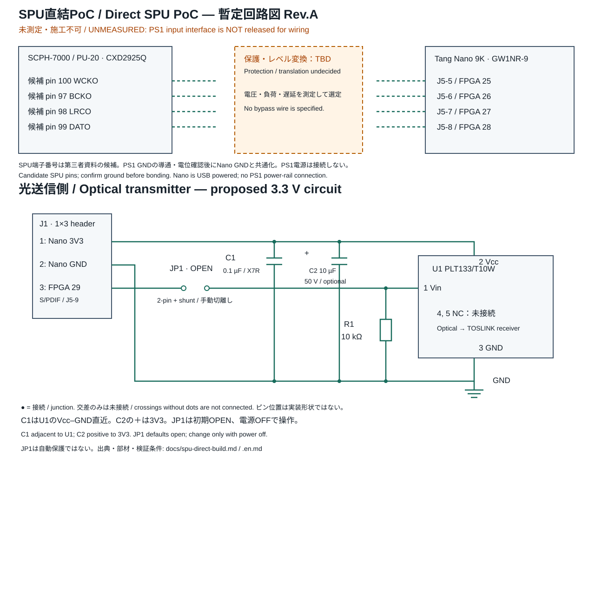
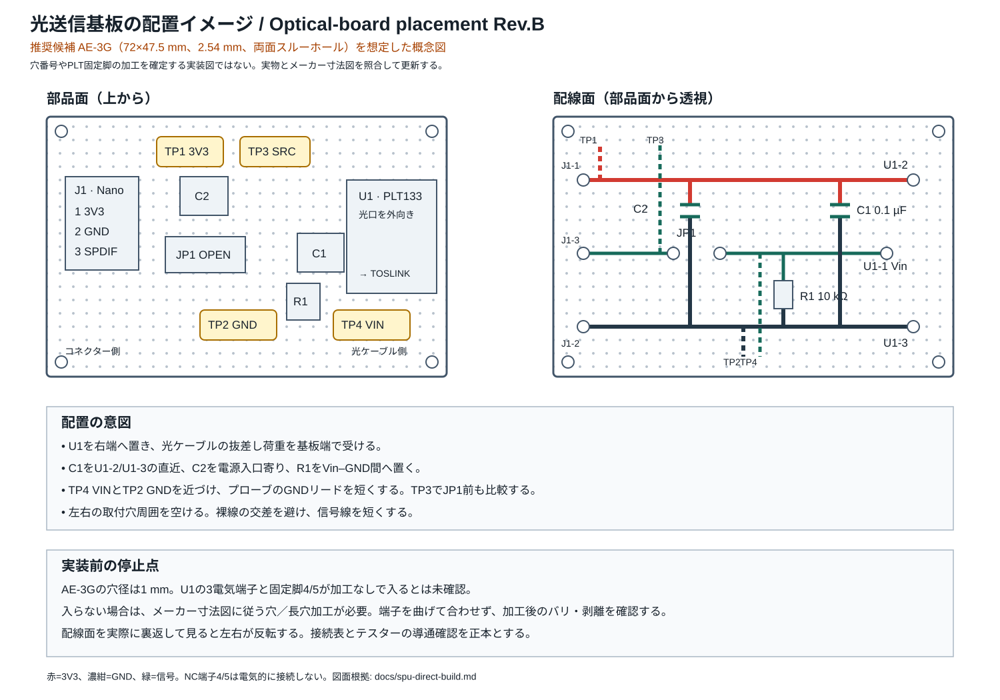

# SPU直結PoC：暫定回路図と秋月購入リスト

[English](spu-direct-build.en.md) / [README](../README.md) / [タイミング検証](timing-validation.md)

日本語を正本とする。Rev.A。PS1側の電圧・波形は未測定。**SPU側は施工不可の暫定設計**であり、保護・レベル変換を省略した直結配線を指示するものではない。
本書は調達計画であり、発注・購入は行っていない。価格・在庫・販売単位は購入時に再確認する。

## 回路図

[拡大できるSVG回路図](spu-direct-circuit.svg)。上段は未確定インターフェース図、下段は部品値付きの光送信回路案。
基板レイアウトや部品の表裏図ではない。SVGは編集可能だがEDA回路データではなく、ERC・PCB製造データは含まない。

## ユニバーサル基板への配置イメージ

[拡大できるSVG配置図](spu-direct-layout.svg)。第一候補のAE-3G（72×47.5mm）を想定した概念図であり、穴番号を指定する実装図ではない。
PLT133/T10Wを光コネクターが基板外向きになる端へ置き、接続用J1と信号切離し用JP1を反対側へ置く。
C1はU1のVcc–GND端子へ最短で配置する。C2は電源入口寄り、R1はVin–GND間に配置する。

チェック端子は4点とする。

| チェック端子 | ネット | 測る内容 |
|---|---|---|
| TP1 | 3V3 | 無負荷・U1動作時の電圧、電源変動 |
| TP2 | GND | 全測定の基準。TP4の近くに置き、プローブGNDを短くする |
| TP3 | SPDIF_SRC | JP1よりFPGA側。FPGA出力だけを確認 |
| TP4 | SPDIF_VIN | JP1よりU1側。U1を接続した状態の波形を確認 |

部品面から見た配置と、配線面を部品面から透視した図を併記している。
実際に基板裏側を見て配線すると左右が反転するため、印刷した図をそのまま裏面の穴位置へ写さない。
導通確認では、図の色ではなく接続表を正本とする。未使用穴を信号間に残し、裸線同士を交差させない。
基板の型番が確定したら、実穴数、取付穴、PLT固定脚、J1の向きに合わせた穴番号付き実装図へ更新する。

### 秋月電子のユニバーサル基板候補

第一候補は**AE-3G**。初めてのユニバーサル基板製作で配線・測定点に余裕を持たせるため、Cタイプを選ぶ。
両面スルーホールなので部品面からもはんだ付け状態を確認しやすく、FR-4・厚さ1.6mmはPLT133/T10Wのメーカー実装例の基板厚1.6mmと一致する。
ただし、厚さの一致は固定脚の穴形状まで適合することを意味しない。

| 優先 | 秋月商品 | 仕様 | 評価 |
|---|---|---|---|
| 第一候補 | [100189 AE-3G 両面スルーホール・FR-4 Cタイプ](https://akizukidenshi.com/catalog/g/g100189/) | 72×47.5×1.6mm、2.54mm、穴径1mm、取付穴3.2mm | 配置余裕と配線作業性を優先。本配置図の想定品 |
| 第二候補 | [103231 両面スルーホール・CEM-3 Cタイプ](https://akizukidenshi.com/catalog/g/g103231/) | 72×47mm、2.54mm | 同じCサイズの代替候補。購入前に最新寸法図を確認 |
| 小型化候補 | [108241 AE-D1 片面 Dタイプ](https://akizukidenshi.com/catalog/g/g108241/) | 47×36×1.6mm、2.54mm、穴径1mm | 回路自体は収まり得るが、初回製作では測定点・固定・配線余裕が少ない |

十字配線や電源レール付き基板は既設パターンの切断確認が増えるため、今回の初回製作では独立ランド型を優先する。
AE-3Gを**2枚**購入し、1枚を加工・練習または失敗時の予備にする案を推奨する。
PLT133/T10Wの電気端子は幅0.5mmとされるが、固定脚を含めてAE-3Gの1mm丸穴にそのまま入るとは確認できていない。
購入後、はんだ付け前に現物を当て、メーカー図と照合する。入らない場合は寸法に合う穴／長穴を加工し、端子を曲げて無理に合わせない。

## 購入できる部材

光送信基板1枚分。Tang Nano 9Kと対応USBケーブルは既存品を前提とする。
コンデンサは手はんだしやすいリード品を選ぶ。

| 図中記号 | 商品・秋月リンク | 使用数 | 購入単位の目安 | 根拠・用途 |
|---|---|---:|---|---|
| PCB | [100189 AE-3G 両面スルーホール・FR-4 Cタイプ](https://akizukidenshi.com/catalog/g/g100189/) | 1 | **2枚推奨** | 72×47.5×1.6mm、2.54mm独立ランド。配置図の想定品。U1固定脚は現物合わせが必要 |
| U1 | [109598 PLT133/T10W](https://akizukidenshi.com/catalog/g/g109598/) | 1 | 1個 | 既存PoCの光送信機。ドライバ内蔵 |
| C1 | [113582 0.1µF50V X7R・2.54mm](https://akizukidenshi.com/catalog/g/g113582/) | 1 | 10個入×1パック | RDER71H104K0P1H03B。メーカー回路の0.1µFに対応。無極性 |
| C2 | [117897 10µF50V・ルビコンPX](https://akizukidenshi.com/catalog/g/g117897/) | 0〜1 | 1個（予備込み2個でも可） | 補助平滑の設計提案。任意。＋を3V3、−をGND |
| R1 | [125103 1/4W 10kΩ](https://akizukidenshi.com/catalog/g/g125103/) | 1 | 100本入×1袋 | VinをLowへ保つプルダウン。メーカー指定抵抗ではない |
| J1・JP1 | [100167 ピンヘッダー1×40](https://akizukidenshi.com/catalog/g/g100167/) | 3極＋2極 | 1本 | 切り分けて入力端子・信号切離し端子に使用。余りはテスト端子にも使える |
| JP1用 | [103890 つまみ付きジャンパーピン・2.54mm](https://akizukidenshi.com/catalog/g/g103890/) | 1 | 20個入×1パック | 出荷／初期状態は外す。電源OFF時だけ操作 |
| 配線候補 | [103475 メス–メス15cm・黒](https://akizukidenshi.com/catalog/g/g103475/) | 必要分 | 1セット | GND等の仮接続用。Nano側もオス端子が実装済みの場合 |
| 配線候補 | [103476 メス–メス15cm・青](https://akizukidenshi.com/catalog/g/g103476/) | 必要分 | 1セット | 電源／信号用は両端をラベルで識別。15cmが高速信号に適切と保証するものではない |
| 測定用・推奨 | [107591 チェック端子TEST-1(BK)](https://akizukidenshi.com/catalog/g/g107591/) | 4 | 10個入×1パック | TP1=3V3、TP2=GND、TP3=SPDIF_SRC、TP4=SPDIF_VIN。ヘッダーで代用可 |
| 固定用・候補 | [107566 ナイロンスペーサーM3・10mm](https://akizukidenshi.com/catalog/g/g107566/) | 4 | 4個 | 基板の穴径に適合する場合。ねじ／ナットは基板決定後に合わせる |
| 調整予備・未実装 | [103941 1/4W 33Ω](https://akizukidenshi.com/catalog/g/g103941/) | 0 | 必要なら100本入×1袋 | リンギング対策候補。現図には入れず、必要時にFPGA出力直近へ追加して再測定 |

**C1は1個しか使わないが、113582は10個入り。** 型番末尾や販売コードを見て、チップ品やY5V品と取り違えない。
R1用の100本袋やジャンパ20個袋は余りが多いため、同仕様の手持ち品があれば購入不要。

### 今回まだ購入を確定しないもの

- PS1→FPGAのバッファ、レベル変換器、保護素子、それらの電源回路：測定後に選ぶ。汎用I²C向け双方向変換基板を音声クロックへ流用しない。
- SPU取り出し用の細線・固定方法・コネクター：対象基板の取り出し点と機械的な負担を確認して選ぶ。15cmジャンパをICの足へ直接付ける施工案ではない。
- 固定ねじ・ナット：AE-3Gの取付穴径3.2mmと、最終的な設置方法に合わせる。PLTの固定脚用加工とは別に選定する。
- 角型TOSLINKケーブル、44.1kHz stereo PCM対応の光入力DAC／アンプ：必要だが、今回の検索で適切な秋月販売品を確認できていない。手持ち品か別店舗で用意する。PLR135等の受光素子単体はDACの代わりにならない。
- はんだごて・フラックス・吸取線・テスター等は手持ちを確認して別途選定。専用の外部3.3V電源は本案では購入しない。

## 光送信側の接続表

| ネット | 接続する端子 |
|---|---|
| 3V3 | J1-1、U1-2 Vcc、C1片側、C2＋（実装時） |
| GND | J1-2、U1-3、C1もう片側、C2−（実装時）、R1片側 |
| SPDIF_SRC | J1-3（Nano FPGA29 / J5-9から）、JP1-1 |
| SPDIF_VIN | JP1-2、U1-1 Vin、R1もう片側 |
| NC | U1-4、U1-5：GND等へ結線しない |

J1の番号は**今回の小基板で新規に定義した番号**であり、Tang Nanoのヘッダー番号ではない。
J1-1/J1-2のNano側接続点は公式回路図と現物表示で3V3/GNDを特定する。PS1電源から給電しない。
JP1は信号だけを切り離す手動部品。電源・GNDの切断、自動保護、PS1側の絶縁機能はない。

## 値と回路の根拠

- **メーカー資料**：PLT133/T10Wは推奨電源2.7〜5.5V、端子1=Vin、2=Vcc、3=GND、4/5=NC。回路例に0.1µFを使用。C1はU1の電源端子間へ最短で配置する。長い線の先のコンデンサでは代用しない。[Everlight Rev.5、2〜4ページ](https://www.everlighteurope.com/custom/files/datasheets/DPL-0000049.pdf)
- **今回の設計提案**：Nanoと光送信機を同じ3.3V系統で給電。メーカーの消費電流上限10mAは表の試験条件Vcc=5V等に基づく値であり、Nano全体の供給余力を証明しない。追加負荷・起動時の電圧・電源順序は実測する。
- **今回の設計提案**：C2=10µFは補助。必須のメーカー指定ではなく、配線や電源変動に応じて使う。C1は省略しない。
- **今回の設計提案**：R1=10kΩはJP1開放時／FPGA高インピーダンス時にVinを浮かせないため。3.3V High時の負荷は約0.33mA。FPGA内蔵pull-up等と競合しないか起動時に測定する。Lowを保証する自動保護回路ではない。
- **メーカー資料＋運用**：VinとVccの電源OFFを揃える。JP1は初期OPEN。書込み前は電源OFFでOPENへ戻す。最初はNanoだけで書込み、ピン方向・信号電圧を確認してから、電源OFFで光基板を接続／JP1を閉じる。通電中の差替えはしない。

## SPU側を完成させる条件

図のCXD2925Q 97/98/99/100は[第三者ピン資料](https://psx-spx.consoledev.net/pinouts/)に基づく候補。Sony一次資料や現物導通による確定ではない。
まず電源基板には触れず、対象PU-20の安全な取り出し点とGNDを確認する。端子へはんだ付けする前に、電圧、周波数、エッジ、左右極性、16-bit RJ境界を確認する。
測定後、保護・変換回路、配線材、取り出し点、CST/SDCを確定する。測定前のバイパス線は設計しない。
Nano入力25〜28、光出力29は[既存CST](../platform/tang_nano_9k/tang_nano_9k.cst)と[Sipeed公式回路図](https://dl.sipeed.com/fileList/TANG/Nano%209K/2_Schematic/Tang_Nano_9k_3672_Schematic.pdf)が根拠。クロック配線資源の配置配線検証は別途必要。

通電前にC2極性、U1端子の表裏、電源短絡、NC端子、JP1開放をテスターで確認する。光送信回路の製作と電圧・信号試験が完了しても、未測定のPS1へ接続する根拠にはならない。
